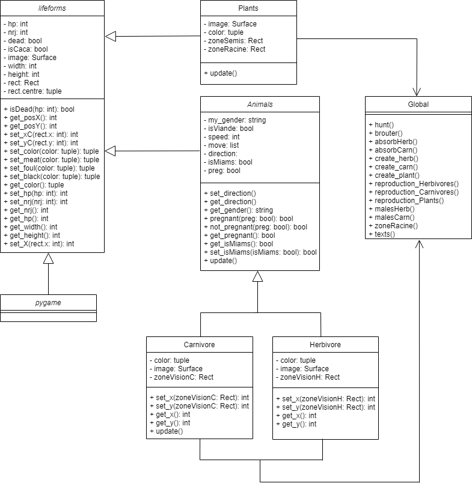

# Programmation orientée objet: Rapport de projet: Ecosystème

## Diagramme de séquences

## Diagramme de classe

## Principes SOLID

Lors de l’élaboration de notre projet nous avons décidé de respecter les 2 premiers principes de l’acronyme SOLID : Single responsability et Open/Close principle. 

Le principe de responsabilité unique dit qu’une classe ne doit avoir qu’une seule responsabilité. Par conséquent si un changement est effectué sur le code, une seule classe sera modifiée et au sein de cette classe le changement n’impactera que la partie concernée par la fonctionnalité modifiée.

Dans notre code on peut voir que ce principe est respecté, car les classes Animals, Carnivores, Herbivores et Plants ont comme méthodes une fonction update ainsi que des getter et setter. Si un getter ou setter est modifié, rien d’autre ne le sera car ils ne sont pas interdépendants d’autres méthodes de la classe. Il est de même pour la méthode update, si on souhaite modifier le mode de déplacement des carnivores par exemple, la fonction update d’une seule classe sera changée, rien d’autre. Concernant les méthodes tel que hunt, brouter et d’autres, elles se trouvent justement hors d’une classe. Ce qui signifie que si l’on souhaite changer ces méthodes, aucune classes ou méthodes ne sera influencer par leur modification.

Le principe Open/Close dit qu’une classe doit être ouverte à l’extension mais fermée à la modification, ce qui signifie qu’on peut y ajouter des éléments de l’extérieur mais on ne peut pas en modifier. 

Afin d’appliquer ce principe nous avons utilisé la relation d’héritage, elle permet d’ajouter des méthodes à une classe sans pour autant modifier les attributs et méthodes déjà existants.  Dans notre code nous avons fait hériter la classe Plants et Animals de Lifeforms ainsi que Carnivores et Herbivores de Animals. Ce qui nous a permis d’implémenter par exemple la méthode isDead dans toutes nos espèces vivantes, sans devoir modifier chacune des classes. 
